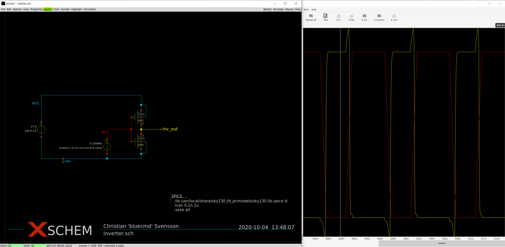
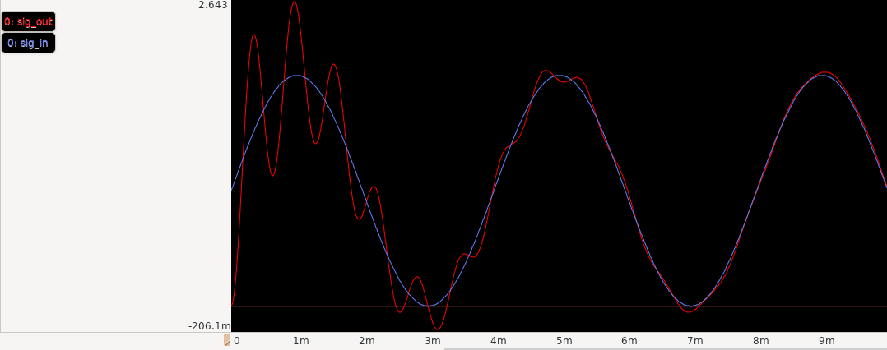

# Getting started with xschem with sky130

Let's build an inverter using xscheme in the
[Skywater 130nm process](https://skywater-pdk.readthedocs.io).

  * [Background](#background)
    * [What is Schematic Capture and why do we need it?](#what-is-schematic-capture-and-why-do-we-need-it)
    * [What is a process?](#what-is-a-process)
  * [Installation](#installation)
    * [Installation of ngspice](#installation-of-ngspice)
    * [Installation of gaw](#installation-of-gaw)
    * [Installation of xschem](#installation-of-xschem)
    * [Installation of sky130 primitives and symbols](#installation-of-sky130-primitives-and-symbols)
  * [Basics of xschem](#basics-of-xschem)
  * [Designing an inverter using sky130](#designing-an-inverter-using-sky130)
    * [Creating the schematic](#creating-the-schematic)
    * [Adding components](#adding-components)
    * [Setting up the simulation configuration](#setting-up-the-simulation-configuration)
    * [Simulating the design](#simulating-the-design)



## Background

You are working for Inverter-Tech Inc. which specializes in taking
something and doing the opposite. So far the company has made a living
by producing batteries that have their polarities inverted. Sales have been
going down, and they now want to break into the digital era. All the rage
in the year 2020 is digital inverters. Taking a 0 and turning it into a 1 seems
to be what all the kids are talking about.

You have been tasked to use the newly open-source'd process called
[sky130](https://skywater-pdk.readthedocs.io) to design the company's new
crown jewel - the Digital(TM) Inverter(R).

### What is Schematic Capture and why do we need it?

It is the process where you *capture* an idea as a *schematic*. It is a term
used to describe producing a schematic which can be used to describe some
electronic circuit. When simulating the component or later designing the
full chip you will use the output of the schematic to verify that the final
result is what your schematic describes. This output is called a *netlist*.

Alternativly you can also design your component in a
Hardware Description Language (HDL) such as Verilog or VHDL. This can the
be used to automatically produce the netlist. It is a very good way to make
large digital designs, but for analog designs it quickly becomes complicated.

In order to design our inverter, we will have to describe it as an electronic
circuit in some form of schematic editor. Here we will use xschem for this
purpose. We could have described it in HDL as explained earlier, but the goal
of this tutorial is to learn how to manually design an inverter using analog
components.

### What is a process?

A process commonly refers to a fabrication process for which chips are made.
Skywater 130 nm is the name of the process we use here, which is usually
shortened to `sky130`. There are hoards of other processes out there but what
makes sky130 special is that it is open-source and does not require signing of
an non-disclosure agreement (NDA) in order for it to be used.

Every process has so called *primitives* that are the basic building blocks
we can use to define a chip in that process. It is crucial that we use those
blocks and when we simulate that we use *models* that describe how those blocks
work in an environment that is as close to what we will have our chip running in
as possible.

The collection of files needed to use a process is called a Process Design Kit
or *PDK*. In our case the PDK we will use is `sky130_fd_pr` which stands for
Skywater 130nm Foundry Primitives.

## Installation

NOTE: The following assumes Ubuntu 20.04. For other Linux distributions the
steps might differ somewhat. Versions might have been updated since the writing
of this guide and you might need to adopt some steps accordingly. Fixes are
very much welcomed!

The tools we will install are:

 * [xscheme](http://repo.hu/projects/xschem/) - A schematic capture tool
 * [ngspice](http://ngspice.sourceforge.net/) - A circuit simulator
 * [gaw](https://gaw.tuxfamily.org/linux/gaw.php) - A waveform viewer to view the simulation results

### Installation of ngspice

A decently recent version of ngsice is present in the Ubuntu repository so
installing it as easy as:

```
sudo apt install ngspice
```

### Installation of gaw

[Gaw](https://gaw.tuxfamily.org/linux/gaw.php) is a fork/rewrite of an older
tool called Gwave. It is used to visualize the simulation data we will produce
with the finished circuit. Without a waveform viewer such as Gaw we would not be
able to see if our inverter works or determine how fast it can operate.

As of this writing Gaw is not packaged for Ubuntu which means we will have to
build it ourselves from the source code.

In order to find the latest version you can check the
[Gaw download page](http://download.tuxfamily.org/gaw/download/).

Open a terminal and execute these commands:

```
sudo apt install libgtk-3-dev build-essential
wget http://download.tuxfamily.org/gaw/download/gaw3-20200922.tar.gz
tar -xf gaw3-20200922.tar.gz
cd gaw3-20200922
./configure
make -j$(nproc)
sudo make install
```

You have now installed gaw into `/usr/local/bin/gaw`.

The xschem software support integration with Gaw, but we need to set that up.
The easiest way to do this is to start Gaw and then quit it. This might sound
strange, but the reason to do this is for it to write out its default
configuration so we can easily edit it.
Go ahead and start Gaw, either from a terminal by typing `gaw` or from
your desktop environment. When it has started go ahead and close it straight
away.

Now let's edit the Gaw configuration. Open the file `~/.gaw/gawrc` either from
the terminal with something like `gedit ~/.gaw/gawrc` or from your desktop
environment. Find the line that says `up_listenPort = 0` and change that to
`up_listenPort = 2020`. Port 2020 is the default port that xschem uses to
talk to Gaw. You can choose another port, but then you will have to configure
xschem to use that port as well.

Congratulations, you are done with the Gaw installation! This is one of the
harder parts so give yourself a pat on the back.

**(Optional)** If you want you can load up an example file into Gaw which will
allow you to get more familar with how Gaw works. To do this,
run `gaw gaw3-20200922/examples/rlc_lpf_trans.dat`. You should see two windows;
a bigger one and a smaller one. The smaller one should contain two entries
named `sig_in` and `sig_out`. These are signal names if you haven't guessed it
already. To view them all you have to do is drag them onto one of those big
black areas in the bigger window. Try dragging both signals to the same window
and you should see something like the below.



### Installation of xschem

**TODO**: Write this in a nicer way, this is just a dump right now

```
sudo apt build-dep xschem # todo: expand to what is actually needed
sudo apt install xterm graphicsmagick ghostscript
# GraphicsMagick is needed for PNG export, ghostscript for pdf
git clone https://github.com/StefanSchippers/xschem.git
./configure
make -j$(nproc)
sudo make install
```

### Installation of sky130 primitives and symbols

**TODO**: Describe why we are doing this maybe.

```
sudo install -o $USER -d /usr/local/share/{sky130_fd_pr,xschem_sky130}
git clone https://foss-eda-tools.googlesource.com/skywater-pdk/libs/sky130_fd_pr /usr/local/share/sky130_fd_pr
git clone https://github.com/StefanSchippers/xschem_sky130 /usr/local/share/xschem_sky130
```

## Basics of xschem

These two videos of using xschem are well worth the time. Watch them and follow
along.

 * [Editing and Simulation in xschem](https://xschem.sourceforge.io/stefan/xschem_man/video_tutorials/editing_and_sim.mp4)
 * [Probing signals with gaw](https://xschem.sourceforge.io/stefan/xschem_man/video_tutorials/probe_to_gaw.mp4)

Congrats! You simulated a schematic using open-source tools!

## Designing an inverter using sky130

It is now time to design the inverter. If you prefer to jump straight to
a finished example to play around with, the final result is available as
`basic-inverter.sch` in this repository.

**Note**: If you installed the PDK somewhere else make sure to update the
`.lib` statement in the SPICE component in the lower-right corner.

### Creating the schematic

The first thing we need to do is to tell xschem what components we are
interested in using. This is done by setting up an `xschemrc` file.

Create a directory where you will store your sky130 schematics and create
a new file called `xschemrc` in that directory. The contents of that file should
be:

```
# Configure xschem project directory to use sky130 symbols
set XSCHEM_LIBRARY_PATH {}
append XSCHEM_LIBRARY_PATH :${XSCHEM_SHAREDIR}/xschem_library
append XSCHEM_LIBRARY_PATH :/usr/local/share/xschem_sky130
```

This instructs xschem to show two libraries:

1) The generic library containing generic SPICE symbols
2) The process-specific sky130 library

We are now ready to start xschem and create our schematic. Open a terminal in
the directory you created and type `xschem`. You should now be looking at
an empty schematic. Save the schematic using `Ctrl+S` and name it something
like `my-first-inverter.sch`.

### Adding components

TODO: Describe the process

Summary for now:

1) Insert two `devices/vsource.sym` (vcc and vin)
1) Insert one `devices/gnd.sym`
1) Insert one `sky130_fd_pr/pfet_01v8.sym` (pmos)
1) Insert one `sky130_fd_pr/nfet_01v8.sym` (nmos)
1) Insert three `devices/lab_pin.sym` (vcc, in, inv\_out)
1) Insert one `devices/code_shown.sym`
1) (Optional) Insert one `devices/title.sym`

Make the vcc 1.8V and the vin something like `pulse(0 1.8 1ns 1ns 1ns 5ns 10ns)`.

In the `code_shown` component, ensure the following properties are set:
```
name=SPICE only_toplevel=false value=".lib /usr/local/share/sky130_fd_pr/models/sky130.lib.spice tt
.tran 0.1n 1u
.save all"
```

### Setting up the simulation configuration

**Note**: You only need to do these steps once and some parts come down to a
matter of taste.

Open up the simulator configuration by going into Simulation -> Configure simulators and tools.

The important thing to select is that Gaw is the preferred `spicewave`
software and that Ngspice is the preferred `spice` software.

It is **very important** that the selected Ngspice is one that produces a
waveform file (i.e. it has the `-r "$n.raw"` flag).
A decent selection is "Ngspice Batch", although I personally
recommend changing the command like to something like the following:

```
$terminal -e 'set -o pipefail; (ngspice -b -r "$n.raw" "$N" | tee "$n.out") || (echo -e "\n** ngspice exited with error code $? **\nPress enter to close"; read)'
```

If you do use that line, I recommend keeping Fg checked and Status unchecked.
With that setup you will get a terminal showing that keeps you apprised on the
simulation progress. The terminal will auto-close if the simulation was
successful, which in the long run saves you time and energy.

When you are finished with the simulator setup, press "Accept and close"

### Simulating the design

TODO: Describe

In summary:

1) Press Netlist, then Simulate, then Waves.
2) Select a net, e.g. `inv_out` and press `Alt+G` to show it in Gaw.

